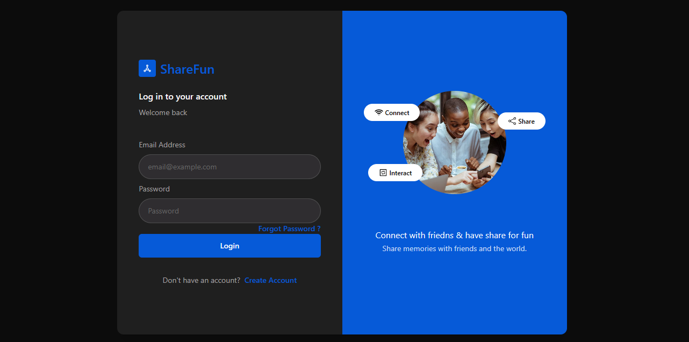
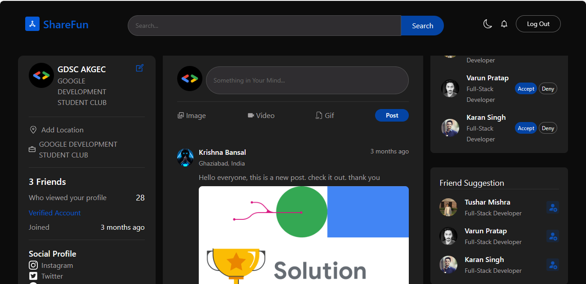

# social-media

### Screenshots of our website

### Create Account Page

The "Create Account" page is an essential component of our website, allowing users to register and create a personalized account. This screenshot showcases the user interface for the account creation process, emphasizing the following features:

- **User-Friendly Form:** The page features an intuitive and user-friendly form where users can input their necessary information to set up an account seamlessly.

- **Secure Registration:** We prioritize user security. The "Create Account" page implements secure registration practices, such as password requirements and validation, to ensure the protection of user accounts.

This screenshot serves as a preview of the smooth and straightforward account creation experience we offer to our users.

### Login Page

The "Login" page is a crucial element of our website, providing a secure gateway for registered users to access their accounts. This screenshot highlights key features of the login experience:

- *Credential Verification:* The page includes a secure login form where users can enter their registered email and password. Robust authentication mechanisms ensure the privacy and security of user accounts.

- *Forgot Password Option:* In case users forget their passwords, our login page offers a "Forgot Password" link or button, guiding them through a secure process to reset and regain access to their accounts.

This screenshot provides a glimpse into the user-friendly and secure login process we've designed to enhance user experience while prioritizing account security.

### Social Media Front Page

The "Social Media Front Page" serves as the hub of our platform, connecting users and facilitating social interactions. This screenshot highlights key components and features of our social media experience:

- **Dynamic Feed:** The front page features a dynamic and personalized feed, showcasing updates, posts, and content from users that a person follows. This allows for real-time engagement with the community.

- **User Profiles:** Each post is linked to the user's profile, providing quick access to their information, activity, and shared content. Users can customize their profiles to reflect their personalities and interests.

- **Engagement Metrics:** Our platform includes engagement metrics, such as likes, comments, encouraging users to interact with and appreciate each other's content.

- **Intuitive Navigation:** The front page offers an intuitive navigation system, making it easy for users to explore different sections, discover new content, and engage with the community effortlessly.

- **Friend's request :** Our page will display friend's request on the ride side.

- *Friend suggestion :* Our page will also displays the friend suggestion to send the friend request.

-**dark mode/light mode :** It will show the icon through which the user can change dark mode to light mode and vice versa.

-**edit profile section:** It will also have a section to edit the profile of the user.

This screenshot provides a glimpse into the vibrant and interactive social media environment we've crafted, fostering meaningful connections and user engagement.
  